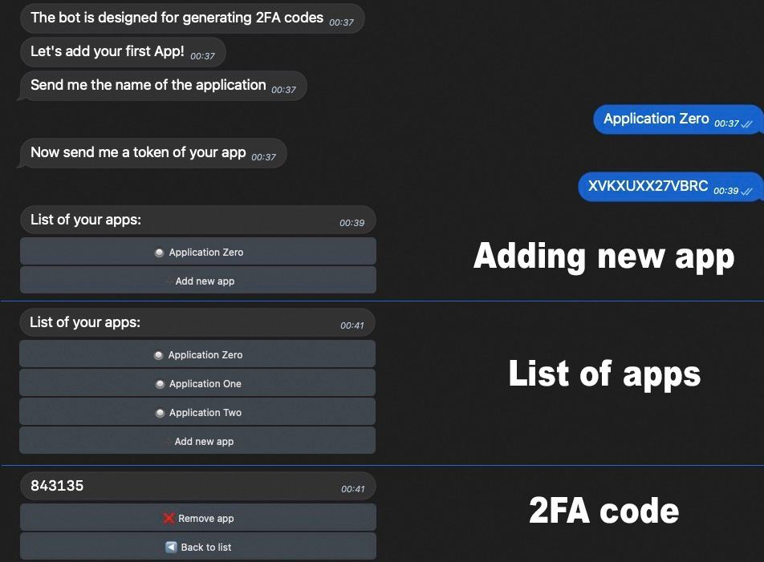

# Telegram bot for managing 2fa codes

<p align="center">
  
</p>

This telegram bot is a simple analogue of Google Authenticator. It allows the user to create and manage a list of applications that require a one-time password (2FA) to log in.

## Usage
Install dependencies:

```bash
  yarn install
```

Bot uses the Redis database

```bash
  docker run -d -p 6379:6379 redis:alpine
```

The URL of the database is specified in `./lib/db.js`

```javascript
const user = createClient({ url: 'base url' });
```

The bot token is specified in `index.js`

```javascript
const bot = new grammy.Bot('bot token');
```